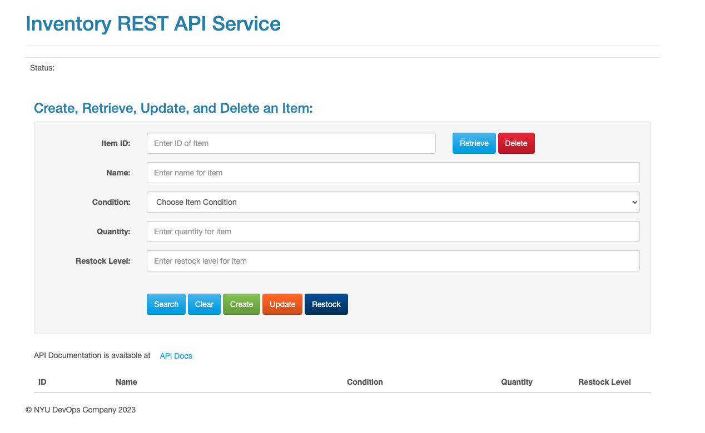

# NYU DevOps Inventory Service

[](https://opensource.org/licenses/Apache-2.0)
[](https://python.org/)
[](https://github.com/CSCI-GA-2820-SP23-003/inventory/actions)
[](https://github.com/CSCI-GA-2820-SP23-003/inventory/actions/workflows/bdd.yml)
[](https://codecov.io/gh/CSCI-GA-2820-SP23-003/inventory)

## Overview

This repository contains the code for Inventory service. This project helps keep track of the assets in the inventory and allows you to effortlessly monitor your inventory with ease.

## Setup the Inventory Service

To run the inventory service:
* git clone the repo
    ```https://github.com/CSCI-GA-2820-SP23-003/inventory```
* Start the service
    ```honcho start```
* Run unit tests
    ```nosetests```


## Contents

The project contains the following:

```text
.gitignore          - this will ignore vagrant and other metadata files
.flaskenv           - Environment variables to configure Flask
.gitattributes      - File to gix Windows CRLF issues
.devcontainers/     - Folder with support for VSCode Remote Containers
dot-env-example     - copy to .env to use environment variables
requirements.txt    - list if Python libraries required by your code
config.py           - configuration parameters

deploy/                - deploy package
├── deployment.yaml    - deployment in Kubernetes
├── postgresql.yaml    - database in Kubernetes
└── service.yaml       - service in Kubernetes

features/                   - test case package for bdd
├── environment.py          - environment setup for bdd
├── inventory.feature       - feature files in gherkin
└── steps                   - steps package
    ├── inventory_steps.py  - setps file for inventory feature
    └── web_steps.py        - steps file for web interactions with Selenium

images/       - images package
└── ui.png    - user interface image

service/                   - service python package
├── __init__.py            - package initializer
├── models.py              - module with business models
├── routes.py              - module with service routes
├── common                 - common code package
    ├── error_handlers.py  - HTTP error handling code
    ├── log_handlers.py    - logging setup code
    └── status.py          - HTTP status constants
└── static                 - rest api user interface code package
    ├── index.html         - home page
    └── js                 - js code package
        └── rest_api.js    - crud oeprations for user interface

tests/              - test cases package
├── __init__.py     - package initializer
├── factories.py    - test suite for factory methods
├── test_models.py  - test suite for business models
└── test_routes.py  - test suite for service routes
```

## Database schema

| Field       | Type        | Description | Primary Key |
| ----------- | ----------- | ----------- | ----------- |
| id      | Integer       | ID of item            | Yes            |
| name      | String       | Name of item            | No            |
| condition   | Enum {NEW, OPEN_BOX, USED}        | Condition of item            | No            |
| quantity   | Integer        | Quantity of item            | No            |
| restock_level   | Integer        | Restock level of item            | No            |
| created_at   | DateTime        | Time of creation of item            | No            |
| updated_at   | DateTime        | Time of updation of item            | No            |


## Access the Inventory Service

- Dev: http://169.51.207.57:31001/
- Prod: http://169.51.207.57:31002/

## User Interface

Following is the User Interface that is provided to the inventory manager when the home page opens.
<h4 align="center">
<p align=center>

</p>
<h4 align="center">

### `Create an Inventory Item`
- Set the required fields of the inventory item.
- Press `Create` and you should get a success message with the `Item ID` field populated.

### `Retrieve an Inventory Item`
- Enter the `Item ID` of the item.
- Press `Retrieve` and you should get a success message with all the fields populated.
- If the `Item Id` does not exist, you would get a `404 Not Found` with all the other fields cleared.

### `Clear the fields`
- Press `Clear` and the form becomes empty and any `Status` message also gets cleared.

### `Search an Inventory Item`
- If the form is empty, then when you press the `Search` button, all the inventory records would be shown.
- If there are some fields filled such as `Name`, `Condition`, `Restock Level`, then the search occurs based on the conditional parameter entered.
- A hint is provided for the user when searching via the `Restock Level`.
- Accepted parameters for searching via the `Restock Level` are `true/True/false/False`.

### `Delete an Inventory Item`
- Enter the `Item ID` and press `Delete`.
- The item would be deleted and the `Status` message would change to `Item has been Deleted!`.

### `Update an Inventory Item`
- Enter the `Item ID`.
- Enter all the other fields and update the parameter which needs to be updated.
- Press the `Update` button.
- You should see the `Status` as Success and the item would have been updated.

### `Restock an Inventory Item`
- Enter the `Item ID`.
- Press the `Restock` button.
- If the item is above the `Restock Level`, you would see a `409 Conflict`.
- If the item does not exist, you would see a `404 Not Found`.
- If the item quantity is below the `Restock Level`, you would see a `Success` message and the fields would get populated with `Restock Level + 1` as the new quantity.

### `API Docs`
- Press the `API Docs` button.
- It will open a new page with the API documentation.

## Inventory APIs

The following segment details out the Inventory Service's CRUD APIs with sample URLs, Request Body, and Responses.

### POST /inventory

Example: `Create – POST  http://localhost:8000/inventory`

Request body:

```json
{
    "name": "TEST_ABC",
    "condition":"NEW",
    "quantity": 69,
    "restock_level": 34
}
```

Response body:

```json
{
    "condition": "NEW",
    "id": 270,
    "name": "TEST_ABC",
    "quantity": 69,
    "restock_level": 34
}
```

### PUT /inventory/[id]

Example: `Update – PUT  http://localhost:8000/inventory/270`

Request body:

```json
{
    "name": "TEST_ABC",
    "condition":"NEW",
    "quantity": 17,
    "restock_level": 34
}
```

Response body:

```json
{
    "condition": "NEW",
    "id": 270,
    "name": "TEST_ABC",
    "quantity": 17,
    "restock_level": 34
}
```

### GET /inventory/[id]

Case 1 :
Example: `Read – GET  http://localhost:8000/inventory/270`

Response body: (Item with id 270 exists)

```json
{
    "condition": "NEW",
    "id": 270,
    "name": "TEST_ABC",
    "quantity": 17,
    "restock_level": 34
}
```

Case 2:
Example: `Get – GET  http://localhost:8000/inventory/270`

Response body: (Item with id 270 does not exists)

```json
{
  "error": "Not Found",
  "message": "404 Not Found: Inventory with id '270' was not found.",
  "status": 404
}
```

### DELETE /inventory/[id]

Example: `Delete – DELETE http://localhost:8000/inventory/270`

Response status: 204 NO CONTENT

### GET /inventory

Example: `List - GET http://localhost:8000/inventory/`

Response body:

```json
[
  {
    "condition": "NEW",
    "id": 270,
    "name": "TEST_ABC",
    "quantity": 17,
    "restock_level": 34
  },
  {
    "condition": "USED",
    "id": 2238,
    "name": "TEST_XYZ",
    "quantity": 105,
    "restock_level": 7
  }
]
```

## License

Copyright (c) John Rofrano. All rights reserved.

Licensed under the Apache License. See [LICENSE](LICENSE)

This repository is part of the NYU masters class: **CSCI-GA.2820-001 DevOps and Agile Methodologies** created and taught by *John Rofrano*, Adjunct Instructor, NYU Courant Institute, Graduate Division, Computer Science, and NYU Stern School of Business.
